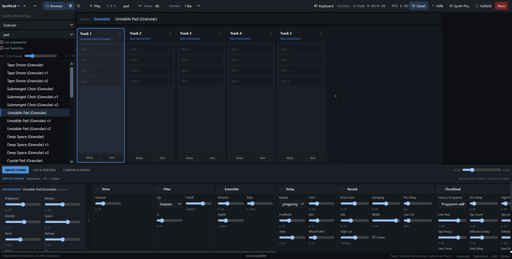

# SynthLab – Next-Gen Web Audio Synthesizer Suite



**SynthLab** ist eine hochmoderne, browserbasierte Synthesizer- und Performance-Plattform, entwickelt mit **React, TypeScript, Vite und Web Audio API**. Sie bietet 23 spezialisierte Synthesizer-Engines und eine kuratierte Bibliothek von **3.356 Presets** mit Mehrspur-Arrangement, interaktivem Audition-System und einem Echtzeit-FX-Rack.

---

## 🌟 Hauptmerkmale & Highlights

- **23 Synthesizer-Engines**: Von klassischer subtraktiver Synthese bis zu echter 6-Op-DX7-FM, C64-SID Chip-Simulation, Additiv, Wavetable, Granular, Physikalischem Modeling, einer Juno-106-artigen DCO-Engine, echter AKWF-Wavetable-Synthese und Yamaha-OPL3-2-Op-FM.
- **3.356 Kuratierte Presets**: Sämtliche Presets sind Zod-schema-validiert, davon **1.859 aus echten Originaldaten importiert** (nicht generiert) und bieten umfassende Klangfarben für Bass, Lead, Pad, Arp, Pluck, Bell, Rhythm, Drone und FX.
- **DX7-Engine (`dx7`)**: Echte 6-Operator-FM (32 Algorithmen, 4-stufiges Rate/Level-Envelope pro Operator) als AudioWorklet, mit **1.024 importierten Original-Yamaha-DX7-Werksvoices** ("BRASS 1", "E.PIANO 1", "STRINGS 1" u.v.m.), dekodiert aus dem klassischen 156-Byte-Voice-Format (Quelle: [`shorepine/amy`](https://github.com/shorepine/amy), MIT; Algorithmus-Routing-Tabelle dort mit Dank an MSFA attributiert).
- **Juno-106 Engine (`juno106`)**: DCO-Synthese (Saw+Pulse/PWM+Sub+Noise), 24dB-Tiefpass, Onboard-Chorus I/II und **128 importierte Original-Roland-Werkspatches** (Bänke A/B), dekodiert aus echten SysEx-Parametern (Quelle: [`shorepine/amy`](https://github.com/shorepine/amy), MIT).
- **AKWF-Wavetable-Engine (`wt-akwf`)**: Wavetable-Scan-Synthese über **261 echte Single-Cycle-Wellenformen**, aus Hardware-Zyklen gesampelt (Quelle: [`KristofferKarlAxelEkstrand/AKWF-FREE`](https://github.com/KristofferKarlAxelEkstrand/AKWF-FREE), CC0-1.0).
- **OPL3-Engine (`opl3`)**: 2-Operator-FM nach Yamaha YMF262 mit **175 echten DOS-Ära-Instrumenten** (128 General-MIDI-Programme + 47 Perkussion), aus der klassischen DMX-GENMIDI-Bank dekodiert (Quelle: [`sneakernets/DMXOPL`](https://github.com/sneakernets/DMXOPL), MIT).
- **C64 SID Lab Engine (`sid-chip`)**: Eigene Web-Audio C64-SID-Simulation mit 3-Stimmen-Kostenmodell, Hard-Sync, Ring-Modulation, PWM-Sweeps und 300 originären SID-Technik-Presets.
- **5 Spezialisierte FM-Engines**: Nachbildung bekannter Open-Source & Hardware FM-Architekturen (Yamaha DX7 6-Op, Sega Genesis YM2612 4-Op, Ameobea Dynamic Morph, Foydel Chaos Feedback & Tone.js Linear Precision).
- **12 Audition Test-Profile**: Vorhörphrasen für schnelles A/B-Testing (`BASS_LOCK`, `BASS_DRONE`, `ARP_HELD`, `MELODY_LEGATO`, `SYNC_RING_PAIR`, `RANGE_VELOCITY` uvm.).
- **Live-Performance & MIDI**: Ansteuerung über Hardware-MIDI-Keyboards, Bildschirm-Tastatur oder integrierte Phrasen-Sequenzen.
- **Ableton-Style FX-Rack**: Modular zuschaltbare Effekte (Drive, Post-Filter, Ensemble Chorus, Tape/PingPong Delay, Freeze Reverb, **CloudSeed Diffusions-Reverb** & Stereo Width).
- **CloudSeed-Reverb**: Multitap-Diffusor, modulierte Allpass-Diffusor-Kette und 12 parallele Cross-Seed-gekoppelte Verzögerungsleitungen, inkl. 9 importierter Factory-Hallprogramme (Architekturreferenz: [`ValdemarOrn/CloudSeed`](https://github.com/ValdemarOrn/CloudSeed), MIT).
- **Dichtes, adaptives Responsive-UI**: Perfekt optimiert für den Viewport (`100vh`) mit separaten Scrollbalken für unkomplizierte Navigation.

---

## 🎹 Synthesizer-Engines & Herkunft

| Engine-ID | Name in der UI | Herkunft / Technische Referenz |
|---|---|---|
| `dx7` | **DX7 (Yamaha 6-Op FM, echte Werksdaten)** | Echtes 6-Op-FM-AudioWorklet; Algorithmus-Tabelle & 1.024 Werksvoices aus `shorepine/amy` (MIT) |
| `juno106` | **Juno-106 (Roland VA)** | Roland Juno-106 DCO-Architektur; Umrechnungskurven & 128 Werkspatches aus `shorepine/amy` (MIT) |
| `wt-akwf` | **AKWF Wavetable (Adventure Kid)** | 261 echte Single-Cycle-Wellenformen aus `KristofferKarlAxelEkstrand/AKWF-FREE` (CC0-1.0) |
| `opl3` | **OPL3 (Yamaha YMF262 2-Op FM)** | Yamaha OPL2/OPL3 2-Op-FM; 175 Instrumente aus `sneakernets/DMXOPL` GENMIDI-Bank (MIT) |
| `sid-chip` | **SID Lab (C64 SID)** | MOS Technology 6581/8580 Commodore 64 Sound Interface Device |
| `fm-dx7` | **FM DX7 (Yamaha DX7 6-Op Matrix)** | Yamaha DX7 Hardware & `ms3000/DX7-WebAudio` / `Tone.js` |
| `fm-4op` | **FM 4-Op (Sega Genesis YM2612 / TX81Z)** | Sega Genesis YM2612 Arcade FM & `g200kg/webaudio-tinysynth` |
| `fm-morph` | **FM Morph (Ameobea Web-Synth Phase Morph)** | `Ameobea/web-synth` dynamic phase morphing |
| `fm-feedback` | **FM Feedback (Foydel High-Chaos Dual FM)** | `ThomasFoydel/fmsynth` cross-feedback loops |
| `fm-linear` | **FM Linear (Tone.js Linear Precision)** | `ToneJS/Tone.js` (`Tone.FMSynth`) |
| `va-poly` | **VA Poly (Moog / Roland Subtractive)** | Klassische Virtual Analog subtraktive Synthese mit Ladder-Filter |
| `wavetable` | **Wavetable** | Dynamische Wavetable-Synthese mit Sweep |
| `fm6` | **FM6 Matrix** | 6-Operator Frequenzmodulation |
| `additive` | **Additive** | Obertonton-Synthese mit Partials |
| `granular` | **Granular** | Grain-Cloud Synthese |
| `modal` | **Modal** | Physikalische Resonanz-Synthese |
| `string` | **Karplus-Strong String** | Karplus-Strong Plucked String Modeling |
| `noisefield` | **Noisefield** | Gefilterte Rauschfeld-Synthese |
| `drone` | **Drone Engine** | Multi-Oszillator Low-Frequency Drone Generator |
| `wavefold` | **Wavefolder** | Wavefolding / West-Coast Shaper Synthese |
| `phasedist` | **Phase Distortion** | Casio CZ-Style Phasenverzerrung |
| `perc` | **Percussion** | Analoge & FM Schlagzeug-Synthese |
| `subbass` | **Sub Bass** | Tiefenfrequenz-Subbass Generator |

---

## 🛠️ Installation & Lokale Ausführung

### Voraussetzungen
- Node.js (Version 18 oder neuer)
- npm oder yarn

### Installation
```bash
# In das synthlab Verzeichnis wechseln
cd synthlab

# Abhängigkeiten installieren
npm install
```

### Entwicklungs-Server starten
```bash
npm run dev
```
Der Entwicklungs-Server startet standardmäßig unter `http://localhost:5173`.

### Tests ausführen
```bash
npx vitest run
```

### TypeScript Typecheck & Production Build
```bash
npm run build
```

---

## ⌨️ Tastatur-Kurzbefehle

- **Leertaste**: Wiedergabe / Stopp der Phrasen-Vorschau
- **Pfeil hoch / runter**: Nächstes / Vorheriges Preset laden
- **1 – 5**: Schnelles Bewerten des aktuellen Presets (1 bis 5 Sterne)
- **F**: Preset als Favorit markieren / abwählen
- **A / B**: A/B-Vergleichs-Slots belegen & umschalten
- **M**: Jitter-Mutation für das aktuelle Preset auslösen
- **Esc / Panic**: Alle aktiven Noten & Oszillatoren sofort stoppen

---

## 📜 Lizenz, Attributierung & Markenhinweise

- **Codebase & Presets**: Der Quellcode und die eigenen Presets sind unter der [MIT-Lizenz](LICENSE) veröffentlicht. Vollständige Drittanbieter-Hinweise befinden sich in [ATTRIBUTION.md](ATTRIBUTION.md).
- **Markenhinweise & Disclaimer**: Alle in diesem Projekt genannten Produktnamen, Marken, eingetragenen Warenzeichen und Firmennamen (*darunter Yamaha, DX7, Roland, Juno-106, Commodore, C64, MOS 6581/8580, Sega Genesis, YM2612, Moog, Ableton, Casio*) sind Eigentum ihrer jeweiligen Inhaber. Ihre Verwendung dient ausschließlich der historischen, technischen Identifikation und Sound-Synthese-Modellierung unter Nominative Fair Use. SynthLab / Ambient Musikmaschine ist ein unabhängiges Open-Source-Projekt und steht in keiner geschäftlichen Verbindung zu diesen Markeninhabern, wird von diesen nicht unterstützt, gesponsert oder autorisiert.

