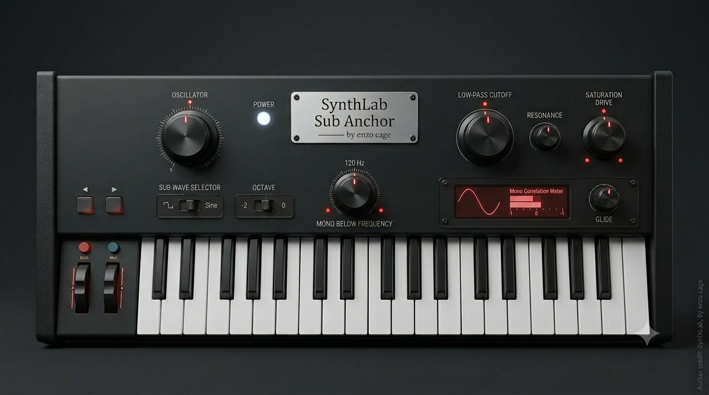

# SynthLab – Next-Gen Web Audio Synthesizer Suite


> **SynthLab** is a high-performance, browser-based digital synthesizer workstation and sound design laboratory built with **React 19, TypeScript, Vite, and Web Audio API / AudioWorklets**. It features **23 specialized synthesizer engines**, **3,356 curated and schema-validated presets**, a multi-stage audition system, and an Ableton-style modular FX rack featuring diffusion reverbs, tape delays, and analog choruses.
>
> Developed with passion by **enzo cage**.

---

## 🙏 Deep Gratitude & Open-Source Acknowledgements

**SynthLab** stands on the shoulders of giants. This project is the culmination of decades of open-source digital signal processing (DSP) research, computer music innovation, and generous code sharing by audio engineers worldwide. 

I am **profoundly grateful** to the authors, research groups, and open-source maintainers whose repositories, mathematical derivations, algorithms, and sound collections inspired and empowered the creation of SynthLab. 

### Featured Repositories & Inspirations

| Project & Upstream Repository | Authors & Maintainers | Contribution & Integration in SynthLab | License |
|---|---|---|---|
| 🌲 [**shorepine/amy**](https://github.com/shorepine/amy) | **Brian Whitman & Daniel P. W. Ellis** | 6-Operator DX7 FM routing architecture, 1,024 original DX7 factory voice definitions, and 128 Roland Juno-106 SysEx parameter regressions. (Algorithm routing originally attributed to MSFA / Music Synthesizer for Android). | MIT |
| ☁️ [**ValdemarOrn/CloudSeed**](https://github.com/ValdemarOrn/CloudSeed) | **Valdemar Erlingsson** | Multi-tap diffuser reverb architecture with modulated allpass chains and 12 parallel cross-seeded delay lines, including 9 imported factory reverb programs. | MIT |
| 🌌 [**airwindows/airwindows**](https://github.com/airwindows/airwindows) | **Chris Johnson** | High-end DSP algorithms adapted for Web Audio Worklets: *Galactic Ambient Reverb* and *Tape Delay / Saturation*. | MIT |
| 🏛️ [**el-visio/dattorro-verb**](https://github.com/el-visio/dattorro-verb) | **Pauli Pölkki** (Algorithm by **Jon Dattorro**, 1997) | Jon Dattorro's 1997 landmark plate reverb topology (pre-delay, input diffusor, coupled tank halves with decay diffusion). | MIT |
| 🎛️ [**pichenettes/eurorack**](https://github.com/pichenettes/eurorack) | **Émilie Gillet** (Mutable Instruments) | Granular texture algorithms (Clouds) and modal resonator models adapted from ARM Cortex-M4 C++ to Web Audio float32. | MIT |
| 🎵 [**Signalsmith-Audio/signalsmith-stretch**](https://github.com/Signalsmith-Audio/signalsmith-stretch) | **Geraint Luff** (Signalsmith Audio Ltd.) | Pitch-shifting and spectral shimmer algorithms adapted for high-quality ambient shimmer worklets. | MIT |
| 🪜 [**ddiakopoulos/MoogLadders**](https://github.com/ddiakopoulos/MoogLadders) | **Dimitri Diakopoulos** (Model by **Aaron Krajeski**) | Non-linear ladder filter mathematical modeling, implementing Krajeski's compromise poles model for zero-oversampling stability. | Unlicense / Public Domain |
| 🌼 [**electro-smith/DaisySP**](https://github.com/electro-smith/DaisySP) | **Electrosmith Corp** | Sample-and-hold bitcrushing, sample rate reduction (Decimator), and multi-stage analog phaser DSP. | MIT |
| 🌊 [**paulnasca/paulstretch_python**](https://github.com/paulnasca/paulstretch_python) | **Nasca Octavian Paul** | Extreme time-stretching and FFT phase randomization algorithms for ambient pad generation. | Public Domain |
| 🌊 [**AKWF-FREE**](https://github.com/KristofferKarlAxelEkstrand/AKWF-FREE) | **Kristoffer Ekstrand ("Adventure Kid")** | 261 single-cycle wavetable samples harvested from analog and digital hardware synthesisers. | CC0 1.0 Universal |
| 🕹️ [**sneakernets/DMXOPL**](https://github.com/sneakernets/DMXOPL) | **Digital eXpress Music / id Software** | 175 DOS-era 2-operator FM instruments from the classic DMX GENMIDI soundbank for YMF262 (OPL3) synthesis. | MIT |
| 🎹 [**ToneJS/Tone.js**](https://github.com/ToneJS/Tone.js) | **Yotam Mann & Contributors** | Web Audio API wrapper patterns and linear FM modulation matrix reference concepts. | MIT |
| 🎚️ [**pendragon-andyh/junox**](https://github.com/pendragon-andyh/junox) | **Andy Henson** | Parameter curve reference studies for Juno-106 DCO pitch and filter response (used for validation). | GPL-3.0 (Reference only) |
| 🌀 [**Ameobea/web-synth**](https://github.com/Ameobea/web-synth) | **Casey Primozic** | Dynamic phase morphing and web-based synthesis interaction patterns. | MIT |
| ⚡ [**ThomasFoydel/fmsynth**](https://github.com/ThomasFoydel/fmsynth) | **Thomas Foydel** | High-chaos cross-feedback FM loop modeling. | MIT |

*To all these creators and the broader open-source community: **Thank you for sharing your knowledge and code with the world. SynthLab would not exist without you.***

---

## 🌟 Key System Highlights

- **23 Specialized Synthesizer Engines**: Subtractive Virtual Analog, 6-Op DX7 FM, Wavetable Scanning, Additive Harmonic Construction, Granular Cloud Sampling, Modal Resonation, Karplus-Strong Physical Modeling, Filtered Noisefields, Stacked Drones, West-Coast Wavefolding, Casio CZ Phase Distortion, Analog Percussion, Sub-Bass, C64 SID Chip Emulation, Sega Genesis YM2612 4-Op FM, OPL3 2-Op FM, and more.
- **3,356 Schema-Validated Presets**: Every preset is strictly typed and validated via Zod schemas. Includes **1,859 authentic imported factory patches** (1,024 DX7 voices, 128 Juno-106 patches, 175 OPL3 instruments, 261 AKWF wavetables, 300 original C64 SID patches).
- **Multi-Threaded AudioWorklet Architecture**: Complex FM matrices, diffusion reverbs, ladder filters, and granular processors run off the main UI thread in dedicated Web Audio `AudioWorkletProcessor` nodes.
- **12 Audition Auditory Profiles**: Built-in phrase audition system (`BASS_LOCK`, `BASS_DRONE`, `ARP_HELD`, `MELODY_LEGATO`, `SYNC_RING_PAIR`, `RANGE_VELOCITY`, etc.) for instant hands-free testing.
- **Ableton-Style FX Rack**: Modular signal processing chain featuring Drive, Post-Filter, Ensemble Chorus, Ping-Pong Delay, Airwindows Galactic Reverb, Dattorro Plate Reverb, and CloudSeed Diffuser.
- **State Management & Persistence**: Powered by Zustand and IndexedDB (`dexie`), enabling local rating (1–5 stars), A/B slot comparisons, favoriting, and custom preset exports.

---

## 🎛️ Complete Synthesizer Engine Gallery & Specifications

Below is the full catalog of all **23 synthesizer engines** in SynthLab, along with their hardware/software inspirations, synthesis paradigms, and dedicated visual renders.

---

### 1. VA Poly – Subtractive Virtual Analog
**Engine ID:** `va-poly` | **Paradigms:** Dual-Oscillator Subtractive, Moog Ladder Filter, Unison Detune


- **Description:** Classic late-1970s polyphonic Virtual Analog synth combining dual sawtooth/pulse/triangle oscillators, sub-oscillators, cross-modulation, hard sync, and a resonant 24dB/octave ladder filter.
- **Hardware Inspiration:** Roland Juno/Jupiter series, Sequential Prophet-5, Moog Minimoog.
- **DSP Highlights:** Anti-aliased BLIT/PolyBLEP waveforms, key-tracking filter, ADSR envelopes for VCF/VCA, stereo unison detune.

---

### 2. Wavetable – Dynamic Spectral Morphing
**Engine ID:** `wavetable` | **Paradigms:** Wavetable Scan, Phase Warp, Unison Spread


- **Description:** Modern digital wavetable engine featuring continuous 3D wavetable index scanning, phase warping (sync, bend, squeeze), and multi-voice unison stacking.
- **Hardware Inspiration:** Waldorf Wave/PPG Wave, Access Virus TI, Modern Softsynths.
- **DSP Highlights:** 3D table interpolation, spectral warp modes, multi-LFO modulation matrix.

---

### 3. FM6 – 6-Operator FM Matrix
**Engine ID:** `fm6` | **Paradigms:** 6-Op Frequency Modulation, 32 Routing Algorithms


- **Description:** Full 6-operator FM matrix offering complete freedom over carrier/modulator pairings across 32 classic routing algorithms, feedback loops, and 4-stage operator envelopes.
- **Hardware Inspiration:** Yamaha DX7, SY77, FS1R.
- **DSP Highlights:** Custom AudioWorklet routing bus, per-operator frequency ratios, detune, and fractional scaling.

---

### 4. Additive – Harmonic Atlas
**Engine ID:** `additive` | **Paradigms:** Partial Construction, Inharmonicity, Spectral Tilt


- **Description:** Additive synthesis generator allowing precise manipulation of up to 32 sine wave partials with customizable spectral tilt, odd/even partial balance, and formant shifters.
- **Hardware Inspiration:** Kawai K5000, New England Digital Synclavier.
- **DSP Highlights:** Real-time additive partial summation, spectral envelope morphing, inharmonic spread.

---

### 5. Granular – Grain Cloud Sampler
**Engine ID:** `granular` | **Paradigms:** Asynchronous Granulation, Time-Stretching, Pitch Jitter


- **Description:** Real-time granular engine slicing audio buffers into dense clouds of grains (10ms–500ms) with randomized position, pitch jitter, stereo panning, and window envelope shaping.
- **Hardware Inspiration:** Mutable Instruments Clouds, Gotobun / Curtis Roads Granular Theory.
- **DSP Highlights:** Asynchronous grain scheduler, Gaussian/Hanning window envelopes, freeze buffer mode.

---

### 6. Modal – Resonance Forge
**Engine ID:** `modal` | **Paradigms:** Struck Modal Resonator Bank, Physical Modeling


- **Description:** Physical modeling engine simulating struck and bowed resonant bodies (wood, metal, glass, membranes) via a bank of tuned bandpass filter resonators.
- **Hardware Inspiration:** Mutable Instruments Elements/Rings, Buchla 296e.
- **DSP Highlights:** Impulse/burst exciter generator, non-linear damping, modal frequency ratio matrices.

---

### 7. String – Karplus–Strong Waveguide
**Engine ID:** `string` | **Paradigms:** Plucked String Modeling, Delay Loop Decay


- **Description:** Digital waveguide physical modeling engine utilizing extended Karplus-Strong algorithms for plucked, struck, and bowed string sounds.
- **Hardware Inspiration:** Yamaha VL1, Karplus-Strong (1983) research paper.
- **DSP Highlights:** Fractional delay lines, lowpass loop filtering, dispersion dynamics, pluck position impulse.

---

### 8. Noise Field – Airloom Atmospheric Filter
**Engine ID:** `noisefield` | **Paradigms:** Filtered Noise, Multi-Peak Bandpass Formants


- **Description:** Specialized atmospheric engine generating white, pink, and brown noise routed through swept multi-peak formant bandpass filters and turbulence modulators.
- **Hardware Inspiration:** EMS VCS3 Noise Generator, Buchla 265.
- **DSP Highlights:** Color noise generators, parallel bandpass arrays, wind/ocean turbulence LFOs.

---

### 9. Drone – Deep Drift Stack
**Engine ID:** `drone` | **Paradigms:** Multi-Oscillator Stack, Micro-Detuning, Beating


- **Description:** Dedicated ambient drone synthesizer stacking 8 micro-detuned analog-style oscillators with slow LFO drift for hypnotic, slowly evolving soundscapes.
- **Hardware Inspiration:** SOMA Lyra-8, Eliane Radigue Custom Drone Systems.
- **DSP Highlights:** Microtonal ratio selectors, beating frequency alignment, analog saturation stage.

---

### 10. Wavefold – West Coast Complex Oscillator
**Engine ID:** `wavefold` | **Paradigms:** Wavefolding, Symmetry Shaping, Low-Pass Gates


- **Description:** West-Coast style complex oscillator combining wavefolding, symmetry offset, frequency modulation, and Buchla-inspired Low-Pass Gate (LPG) dynamics.
- **Hardware Inspiration:** Buchla 259, Serge Wavefolders, Make Noise DPO.
- **DSP Highlights:** Multi-stage sine wavefolder, vactrol decay emulation, non-linear harmonic generation.

---

### 11. Phase Distortion – Phase Vector
**Engine ID:** `phasedist` | **Paradigms:** Casio CZ Phase Distortion, Waveform Remapping


- **Description:** Re-implementation of 1980s Phase Distortion synthesis, bending linear phase readouts of sine waves into resonant saws, pulses, and double-peaks without traditional filters.
- **Hardware Inspiration:** Casio CZ-101 / CZ-1 / CZ-5000.
- **DSP Highlights:** Cosine phase distortion curves, DCW envelope modulation, hard sync phase resets.

---

### 12. Percussion – Pulse Cabinet
**Engine ID:** `perc` | **Paradigms:** Analog & FM Drum Synthesis, Modal Percussion


- **Description:** Electronic drum and percussion synthesizer combining pitch-swept sine oscillators, noise burst generators, and FM transient impact generators.
- **Hardware Inspiration:** Roland TR-808 / TR-909, Simmons SDS-V.
- **DSP Highlights:** Exponential pitch envelopes, transient click generator, snappy noise decay gates.

---

### 13. Sub Bass – Sub Anchor
**Engine ID:** `subbass` | **Paradigms:** Fundamental Bass Generation, Mono Frequency Locking



- **Description:** Precision low-end sub-bass generator focusing on fundamental frequencies below 120Hz, featuring sub-harmonics, saturation, and mono-correlation locking.
- **Hardware Inspiration:** Moog Minitaur / Taurus, DBX 120 Subharmonic Synthesizer.
- **DSP Highlights:** Phase-coherent sub-octave generation, low-end drive stage, glide dynamics.

---

### 14. SID Lab – C64 Chip Emulator
**Engine ID:** `sid-chip` | **Paradigms:** MOS 6581/8580 Emulation, Ring Mod, Hard Sync


- **Description:** Chiptune sound generator recreating the iconic MOS Technology 6581/8580 Sound Interface Device from the Commodore 64, with 300 original SID presets.
- **Hardware Inspiration:** Commodore 64 (MOS 6581 / 8580 SID).
- **DSP Highlights:** Non-linear SID filter curve modeling, combined pulse/saw/triangle waveforms, fast arpeggiator tables.

---

### 15. FM DX7 – 6-Operator Matrix Synthesizer
**Engine ID:** `fm-dx7` | **Paradigms:** DX7 Web Audio Architecture, FM Operator Matrix


- **Description:** Web Audio implementation of classic 6-operator FM synthesis, optimized for glassy electric pianos, bell textures, and metallic digital soundscapes.
- **Hardware Inspiration:** Yamaha DX7 / DX7IIFD.
- **DSP Highlights:** Operator envelope rate/level stages, feedback loops, ratio/fixed pitch modes.

---

### 16. FM 4-Op – YM2612 / TX81Z Character
**Engine ID:** `fm-4op` | **Paradigms:** 4-Operator FM, 8 Algorithms, 16-Bit Chip Character


- **Description:** Gritty 4-operator FM engine capturing the character of 16-bit arcade/console sound chips and late-80s rack modules.
- **Hardware Inspiration:** Sega Genesis / Megadrive (Yamaha YM2612), Yamaha TX81Z.
- **DSP Highlights:** 8 classic 4-op algorithms, non-sine operator waveforms (tx waveforms), 8-bit DAC quantization options.

---

### 17. FM Morph – Dynamic State Shifter
**Engine ID:** `fm-morph` | **Paradigms:** XY Pad Morphing, Continuous Carrier Modulation


- **Description:** Experimental FM engine enabling fluid, real-time vector morphing between carrier shapes, modulation indices, and harmonic ratios.
- **Hardware Inspiration:** Korg WAVESTATION, Sequential Prophet-VS, Ameobea Web Synth.
- **DSP Highlights:** 2D vector interpolation matrix, continuous phase morphing.

---

### 18. FM Feedback – High-Chaos Reactor
**Engine ID:** `fm-feedback` | **Paradigms:** Cross-Feedback Loops, Non-Linear Saturation


- **Description:** High-chaos dual-operator FM engine designed for abrasive metallic textures, self-oscillating feedback loops, and controlled instability.
- **Hardware Inspiration:** Industrial FM hardware, Foydel FM Synth.
- **DSP Highlights:** Cross-operator feedback routing, soft-clip limiters, chaos LFO modulators.

---

### 19. FM Linear – Precision Linear FM
**Engine ID:** `fm-linear` | **Paradigms:** Linear Frequency Modulation, Phase-Coherent Sidebands


- **Description:** Laboratory-grade linear FM engine maintaining pitch stability during high-index modulation, creating clean, mathematically precise harmonics.
- **Hardware Inspiration:** Synclavier II, Tone.js Linear FMSynth.
- **DSP Highlights:** Zero-pitch-shift linear FM, dual spectrum visualizers, exact harmonicity ratios.

---

### 20. Juno-106 – Authentic Roland DCO Engine
**Engine ID:** `juno106` | **Paradigms:** DCO Polyphony, 24dB VCF, Dual-Mode Stereo Chorus


- **Description:** Re-creation of the Roland Juno-106 architecture featuring DCO pulse/sawtooth waves, sub-oscillator, HPF, 24dB VCF, and the iconic BBD Stereo Chorus (Modes I & II), with 128 imported factory SysEx patches.
- **Hardware Inspiration:** Roland Juno-106 / Juno-60.
- **DSP Highlights:** SysEx parameter decoding from `amy`, bucket-brigade delay chorus emulation, resonant self-oscillating VCF.

---

### 21. AKWF Wavetable – Adventure Kid Archive Engine
**Engine ID:** `wt-akwf` | **Paradigms:** Single-Cycle Sample Scanning, CC0 Waveform Library


- **Description:** Dedicated wavetable engine scanning **261 single-cycle waveforms** from the open-source AKWF library, offering single-cycle sample playback with anti-aliasing.
- **Hardware Inspiration:** Adventure Kid AKWF Library, Waldorf Blofeld.
- **DSP Highlights:** 261 single-cycle PCM sample buffers, linear phase interpolation, filter envelope control.

---

### 22. OPL3 – Yamaha YMF262 2-Op FM Engine
**Engine ID:** `opl3` | **Paradigms:** 2-Op FM, DMX GENMIDI Soundbank, DOS Audio Nostalgia


- **Description:** 2-operator FM engine simulating the Yamaha YMF262 (OPL3) sound chip, pre-loaded with **175 authentic DOS-era General MIDI instruments** decoded from the classic DMX soundbank.
- **Hardware Inspiration:** Sound Blaster 16, Yamaha YMF262 OPL3.
- **DSP Highlights:** 4 OPL waveforms (sine, half-sine, abs-sine, pulse-sine), feedback scaling, GENMIDI patch decoder.

---

### 23. DX7 Werksvoices Engine – 1,024 Original Factory Voices
**Engine ID:** `dx7` | **Paradigms:** 6-Op FM AudioWorklet, 1,024 Imported Yamaha DX7 Rom Voices


- **Description:** Flagship 6-operator FM engine powered by a custom `AudioWorkletProcessor`, pre-loaded with **1,024 authentic Yamaha DX7 ROM factory presets** ("BRASS 1", "E.PIANO 1", "MARIMBA", "TUBBELL", etc.) decoded directly from original 156-byte voice binary dumps.
- **Hardware Inspiration:** Original 1983 Yamaha DX7 Hardware.
- **DSP Highlights:** Direct 156-byte voice binary decoder (from `amy` MIT dataset), 32-algorithm AudioWorklet bus mixer, sample-accurate 4-stage operator rate/level envelope generator.

---

## 💻 Installation & Local Execution

### Prerequisites
- **Node.js**: Version 18.0.0 or higher
- **npm** or **yarn**

### Quick Start Guide

```bash
# 1. Clone the repository
git clone https://github.com/enzocage/synthLab.git
cd synthLab/synthlab

# 2. Install dependencies
npm install

# 3. Start local development server (Vite)
npm run dev
```

The application will launch locally at `http://localhost:5173`.

### Automated Testing & Production Build

```bash
# Run unit & integration test suite (Vitest)
npx vitest run

# Run TypeScript typechecks & build production bundle
npm run build

# Preview production build locally
npm run preview
```

---

## ⌨️ Keyboard Shortcuts & Audition Guide

| Key | Action |
|---|---|
| **Spacebar** | Toggle Play / Pause for Phrase Audition |
| **Arrow Up / Down** | Load Next / Previous Preset |
| **1 – 5** | Rate Current Preset (1 to 5 Stars in IndexedDB) |
| **F** | Toggle Favorite Status for Current Preset |
| **A / B** | Set / Compare A/B Comparison Memory Slots |
| **M** | Trigger Jitter Mutation on Current Preset Parameters |
| **Esc / Panic** | Immediate Audio Emergency Stop (Silence All Voices) |

---

## 📜 Legal Notice, Nominative Fair Use & Trademarks

- **Codebase & Original Presets**: Released under the [MIT License](LICENSE).
- **Third-Party Attribution**: Full credits, licenses, and upstream links are documented in [ATTRIBUTION.md](ATTRIBUTION.md).
- **Trademark Notice & Disclaimer**: All product names, trademarks, registered trademarks, and brand names mentioned in this project (*including Yamaha, DX7, Roland, Juno-106, Commodore, C64, MOS 6581/8580, Sega Genesis, YM2612, Moog, Ableton, Casio*) are the property of their respective owners. Their use in this project is strictly for historical, technical identification, and sound synthesis modeling purposes under **Nominative Fair Use**. SynthLab is an independent open-source project and is NOT affiliated with, authorized, endorsed, or sponsored by any of these trademark holders.

---

<p center>
  <i>Built with dedication for sound designers, music producers, and audio code enthusiasts worldwide.</i><br />
  <strong>SynthLab — by enzo cage (2026)</strong>
</p>
