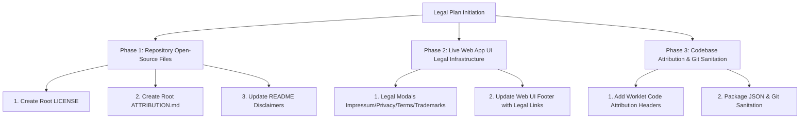

# Legal Implementation Plan: Resolving All Legal Issues

**Project:** SynthLab / Ambient Musikmaschine (`ambient2`)  
**Based on:** `legal.md` (Legal & Compliance Audit)  
**Goal:** Concrete, step-by-step implementation plan to fix all legal requirements for both the public GitHub repository and the live web application.  
**File:** `legalplan.md`  

---

## Plan Overview & Phased Roadmap

This plan breaks down all legal fixes into 3 actionable phases:



---

## Phase 1: Repository Open-Source Files (GitHub / Public Repo)

### 1.1 Create Root `LICENSE` File
- **Target File:** `c:\Users\enzoc\Desktop\AI Code\ambient2\LICENSE`
- **Action:** Create the standard MIT License file.

```text
MIT License

Copyright (c) 2026 SynthLab / Ambient Musikmaschine Contributors

Permission is hereby granted, free of charge, to any person obtaining a copy
of this software and associated documentation files (the "Software"), to deal
in the Software without restriction, including without limitation the rights
to use, copy, modify, merge, publish, distribute, sublicense, and/or sell
copies of the Software, and to permit persons to whom the Software is
furnished to do so, subject to the following conditions:

The above copyright notice and this permission notice shall be included in all
copies or substantial portions of the Software.

THE SOFTWARE IS PROVIDED "AS IS", WITHOUT WARRANTY OF ANY KIND, EXPRESS OR
IMPLIED, INCLUDING BUT NOT LIMITED TO THE WARRANTIES OF MERCHANTABILITY,
FITNESS FOR A PARTICULAR PURPOSE AND NONINFRINGEMENT. IN NO EVENT SHALL THE
AUTHORS OR COPYRIGHT HOLDERS BE LIABLE FOR ANY CLAIM, DAMAGES OR OTHER
LIABILITY, WHETHER IN AN ACTION OF CONTRACT, TORT OR OTHERWISE, ARISING FROM,
OUT OF OR IN CONNECTION WITH THE SOFTWARE OR THE USE OR OTHER DEALINGS IN THE
SOFTWARE.
```

---

### 1.2 Create Root `ATTRIBUTION.md` File
- **Target File:** `c:\Users\enzoc\Desktop\AI Code\ambient2\ATTRIBUTION.md`
- **Action:** Create a full Third-Party Notices & Attribution file documenting every open-source dependency, DSP algorithm origin, and dataset source.

```markdown
# Third-Party Notices & Open Source Attribution

SynthLab / Ambient Musikmaschine incorporates code, mathematical models, sound tables, and digital signal processing (DSP) algorithms from third-party open-source projects. We gratefully acknowledge the authors and maintainers of these projects.

---

## 1. Adapted DSP Algorithms & Worklets

### DX7 AudioWorklet & Math
- **File(s):** `synthlab/src/audio/worklets/dx7.worklet.ts`, `dx7Math.ts`
- **Upstream Project:** [`shorepine/amy`](https://github.com/shorepine/amy)
- **License:** MIT License
- **Original Copyright:** Copyright (c) 2022 Brian Whitman and Daniel P. W. Ellis
- **Note:** Algorithm routing structure originally attributed to MSFA (Music Synthesizer for Android).

### Juno-106 Synthesizer Engine
- **File(s):** `synthlab/src/presets/junoPresets.ts`, `synthlab/src/data/derived/juno106-patches.json`
- **Upstream Project:** [`shorepine/amy`](https://github.com/shorepine/amy)
- **License:** MIT License
- **Original Copyright:** Copyright (c) 2022 Brian Whitman and Daniel P. W. Ellis
- **Reference Note:** Parameter regression curves zitiert nach [`pendragon-andyh/junox`](https://github.com/pendragon-andyh/junox) (GPL-3.0 comparison reference only; no GPL code copied).

### CloudSeed Diffuser Reverb
- **File(s):** `synthlab/src/audio/worklets/WorkletFx.ts`, `synthlab/src/data/derived/cloudseed-programs.json`
- **Upstream Project:** [`ValdemarOrn/CloudSeed`](https://github.com/ValdemarOrn/CloudSeed)
- **License:** MIT License
- **Original Copyright:** Copyright (c) 2018 Valdemar Erlingsson

### Airwindows Galactic & Tape Reverb
- **File(s):** `synthlab/src/audio/worklets/galactic.worklet.ts`, `tape.worklet.ts`
- **Upstream Project:** [`airwindows/airwindows`](https://github.com/airwindows/airwindows)
- **License:** MIT License
- **Original Copyright:** Copyright (c) 2018 Chris Johnson

### Dattorro Plate Reverb
- **File(s):** `synthlab/src/audio/worklets/plate.worklet.ts`
- **Upstream Project:** [`el-visio/dattorro-verb`](https://github.com/el-visio/dattorro-verb)
- **License:** MIT License
- **Original Copyright:** Copyright (c) 2022 Pauli Pölkki (Algorithm by Jon Dattorro, 1997)

### Mutable Instruments Clouds & Resonator
- **File(s):** `synthlab/src/audio/worklets/clouds.worklet.ts`, `resonator.worklet.ts`
- **Upstream Project:** [`pichenettes/eurorack`](https://github.com/pichenettes/eurorack)
- **License:** MIT License
- **Original Copyright:** Copyright Émilie Gillet

### Signalsmith Stretch Shimmer
- **File(s):** `synthlab/src/audio/worklets/shimmer.worklet.ts`
- **Upstream Project:** [`Signalsmith-Audio/signalsmith-stretch`](https://github.com/Signalsmith-Audio/signalsmith-stretch)
- **License:** MIT License
- **Original Copyright:** Copyright (c) 2022 Geraint Luff / Signalsmith Audio Ltd.

### Moog Ladder Filter Collection
- **File(s):** `synthlab/src/audio/worklets/ladder.worklet.ts`
- **Upstream Project:** [`ddiakopoulos/MoogLadders`](https://github.com/ddiakopoulos/MoogLadders)
- **License:** Unlicense / Public Domain
- **Original Author:** Dimitri Diakopoulos

### DaisySP Lo-Fi & Phaser
- **File(s):** `synthlab/src/audio/worklets/lofi.worklet.ts`, `synthlab/src/audio/fx/Phaser.ts`
- **Upstream Project:** [`electro-smith/DaisySP`](https://github.com/electro-smith/DaisySP)
- **License:** MIT License
- **Original Copyright:** Copyright (c) Electrosmith Corp

### Paulstretch
- **File(s):** `synthlab/src/audio/worklets/paulstretch.worklet.ts`, `dsp/fft.ts`
- **Upstream Project:** [`paulnasca/paulstretch_python`](https://github.com/paulnasca/paulstretch_python)
- **License:** Public Domain
- **Original Author:** Nasca Octavian Paul

---

## 2. Presets & Sound Tables

### AKWF Single-Cycle Waveforms
- **Source:** [`KristofferKarlAxelEkstrand/AKWF-FREE`](https://github.com/KristofferKarlAxelEkstrand/AKWF-FREE)
- **License:** Creative Commons Zero v1.0 Universal (CC0 1.0 Public Domain Dedication)
- **Author:** Kristoffer Ekstrand ("Adventure Kid")

### OPL3 DMX GENMIDI Bank
- **Source:** [`sneakernets/DMXOPL`](https://github.com/sneakernets/DMXOPL)
- **License:** MIT License
- **Original Format Creator:** Digital eXpress Music / id Software
```

---

### 1.3 Update `README.md` Files with Trademark Disclaimer
- **Target File(s):** `c:\Users\enzoc\Desktop\AI Code\ambient2\README.md` and `synthlab/README.md`
- **Action:** Append explicit License, Attribution, and Trademark Disclaimer sections to the end of the README.

```markdown
## 📜 License & Trademarks

- **Codebase & Original Assets:** Published under the [MIT License](LICENSE). See [ATTRIBUTION.md](ATTRIBUTION.md) for complete open-source third-party notices.
- **Trademark Disclaimer:** All product names, trademarks, registered trademarks, and brand names mentioned in this project (including *Yamaha, DX7, Roland, Juno-106, Commodore, C64, MOS 6581/8580, Sega Genesis, YM2612, Moog, Ableton, Casio*) are the property of their respective owners. Their use in this project is strictly for historical, technical identification, and sound synthesis modeling purposes under nominative fair use. SynthLab / Ambient Musikmaschine is an independent open-source project and is NOT affiliated with, authorized, endorsed, or sponsored by any of these trademark holders.
```

---

## Phase 2: Live Web Application UI Legal Infrastructure

To comply with EU / German digital service laws (§ 5 DDG, DSGVO / GDPR, DSA), we will build standard legal modals and a persistent footer menu in `synthlab`.

### 2.1 Create Legal Modals Container Component
- **Target File:** `c:\Users\enzoc\Desktop\AI Code\ambient2\synthlab\src\ui\legal\LegalModals.tsx`
- **Action:** Create tabbed/selectable legal modal dialogs covering Impressum, Privacy Policy, Terms of Service, and Trademark Notice.

```tsx
import React, { useState } from 'react';

export type LegalModalType = 'none' | 'impressum' | 'privacy' | 'terms' | 'trademarks';

interface LegalModalsProps {
  activeModal: LegalModalType;
  onClose: () => void;
}

export const LegalModals: React.FC<LegalModalsProps> = ({ activeModal, onClose }) => {
  if (activeModal === 'none') return null;

  return (
    <div style={{
      position: 'fixed',
      top: 0,
      left: 0,
      width: '100vw',
      height: '100vh',
      backgroundColor: 'rgba(0, 0, 0, 0.75)',
      backdropFilter: 'blur(4px)',
      display: 'flex',
      alignItems: 'center',
      justifyContent: 'center',
      zIndex: 9999,
      color: '#e0e0e0',
      fontFamily: 'sans-serif'
    }}>
      <div style={{
        backgroundColor: '#1a1a24',
        border: '1px solid #333344',
        borderRadius: '12px',
        width: '90%',
        maxWidth: '750px',
        maxHeight: '85vh',
        overflowY: 'auto',
        padding: '24px',
        boxShadow: '0 20px 50px rgba(0,0,0,0.5)'
      }}>
        <div style={{ display: 'flex', justifyContent: 'space-between', alignItems: 'center', borderBottom: '1px solid #333', pb: '12px', marginBottom: '16px' }}>
          <h2 style={{ margin: 0, fontSize: '1.4rem', color: '#61dafb' }}>
            {activeModal === 'impressum' && 'Impressum / Legal Notice'}
            {activeModal === 'privacy' && 'Datenschutzerklärung / Privacy Policy'}
            {activeModal === 'terms' && 'Nutzungsbedingungen / Terms of Service'}
            {activeModal === 'trademarks' && 'Marken & Copyright Disclaimers'}
          </h2>
          <button 
            onClick={onClose}
            style={{
              background: 'transparent',
              border: 'none',
              color: '#888',
              fontSize: '1.5rem',
              cursor: 'pointer'
            }}
          >×</button>
        </div>

        <div style={{ fontSize: '0.95rem', lineHeight: '1.6' }}>
          {activeModal === 'impressum' && <ImpressumContent />}
          {activeModal === 'privacy' && <PrivacyContent />}
          {activeModal === 'terms' && <TermsContent />}
          {activeModal === 'trademarks' && <TrademarksContent />}
        </div>
      </div>
    </div>
  );
};

const ImpressumContent: React.FC = () => (
  <div>
    <h3>Anbieterkennzeichnung gem. § 5 DDG / § 18 MStV</h3>
    <p><strong>Betreiber der Website:</strong> [Ihr Name / Your Full Legal Name]</p>
    <p><strong>Anschrift:</strong><br />[Musterstraße 123]<br />[12345 Musterstadt]<br />[Deutschland / Germany]</p>
    <p><strong>Kontakt:</strong><br />E-Mail: [ihre.email@example.com]<br />Telefon: [Optional / +49 123 456789]</p>
    <p><strong>Verantwortlich für den Inhalt nach § 18 Abs. 2 MStV:</strong><br />[Ihr Name, Anschrift wie oben]</p>
  </div>
);

const PrivacyContent: React.FC = () => (
  <div>
    <h3>Datenschutzerklärung (DSGVO / GDPR)</h3>
    <h4>1. Datenschutz auf einen Blick</h4>
    <p>Diese Web-App verarbeitet Audiodaten und Synthesizer-Einstellungen zu 100% lokal im Browser des Nutzers. Es werden keine Audiosignale oder Eingabedaten an externe Server übermittelt.</p>
    
    <h4>2. Lokale Speicherung (IndexedDB & LocalStorage)</h4>
    <p>Zur Speicherung eigener Presets, Favoriten und UI-Einstellungen nutzt die App IndexedDB (`dexie`) und LocalStorage im Browser. Die Speicherung erfolgt auf Grundlage von Art. 6 Abs. 1 lit. f DSGVO zur Bereitstellung der App-Funktionalität.</p>

    <h4>3. Server-Log-Dateien</h4>
    <p>Beim Aufruf der Web-App erhebt der Webhosting-Anbieter (z.B. Cloudflare / GitHub Pages) automatisch Informationen in Server-Log-Dateien (IP-Adresse, Browser-Typ, Uhrzeit). Dies erfolgt auf Grundlage von Art. 6 Abs. 1 lit. f DSGVO zur IT-Sicherheit.</p>

    <h4>4. Rechte der betroffenen Person</h4>
    <p>Sie haben das Recht auf Auskunft, Berichtigung, Löschung und Einschränkung der Verarbeitung Ihrer personenbezogenen Daten.</p>
  </div>
);

const TermsContent: React.FC = () => (
  <div>
    <h3>Nutzungsbedingungen & Rechte an Audiosignalen</h3>
    <h4>1. Rechte an generierten Audiodaten</h4>
    <p>Nutzer erhalten das <strong>100% uneingeschränkte Eigentum und Urheberrecht</strong> an allen Audiodaten, Musikstücken, Samples und Presets, die mit SynthLab erzeugt oder exportiert werden. Dies umfasst sowohl die kommerzielle als auch die nicht-kommerzielle Nutzung ohne Lizenzgebühren.</p>

    <h4>2. Haftungsausschluss & Gehörschutz-Warnung (Audio Safety Warning)</h4>
    <p>⚠️ <strong>WICHTIGER GEHÖRSCHUTZ-HINWEIS:</strong> Synthesizer und Audionetzwerke mit Feedbackschleifen und Filtern können im Einzelfall plötzliche Lautstärkespitzen oder hochfrequente Oszillationen erzeugen. Nutzen Sie Kopfhörer und Lautsprecher stets mit angemessener Lautstärke.</p>
    <p>Die Software wird "AS IS" (wie besehen) bereitgestellt. Der Betreiber übernimmt keine Haftung für Hörschäden, Lautsprecherschäden oder Datenverluste.</p>
  </div>
);

const TrademarksContent: React.FC = () => (
  <div>
    <h3>Markenhinweise (Trademark Notice)</h3>
    <p>Alle in dieser Software erwähnten Marken, Produktnamen und Firmennamen (darunter <em>Yamaha, DX7, Roland, Juno-106, Commodore, C64, MOS 6581/8580, Sega Genesis, YM2612, Moog, Ableton, Casio</em>) sind eingetragene Warenzeichen ihrer jeweiligen Eigentümer.</p>
    <p>Ihre Nennung dient ausschließlich der technischen Beschreibung und Modellierung von Syntheseverfahren (Nominative Fair Use). SynthLab steht in keiner geschäftlichen Verbindung zu diesen Herstellern.</p>
  </div>
);
```

---

### 2.2 Update UI Footer with Legal Links
- **Target File:** `c:\Users\enzoc\Desktop\AI Code\ambient2\synthlab\src\ui\Footer.tsx` (or `App.tsx`)
- **Action:** Add clickable footer links for Impressum, Privacy Policy, Terms of Service, and Trademark Notice.

---

## Phase 3: Codebase Attribution & Git Sanitation

### 3.1 Worklet Source Code Attribution Headers
- **Target Files:** All adapted worklet files under `synthlab/src/audio/worklets/`
- **Action:** Add standardized top-of-file copyright headers to all worklet source files.

Example header for `dx7.worklet.ts`:
```typescript
/**
 * Adapted from shorepine/amy (https://github.com/shorepine/amy)
 * Copyright (c) 2022 Brian Whitman and Daniel P. W. Ellis
 * License: MIT License
 * 
 * Routing structure originally attributed to MSFA (Music Synthesizer for Android).
 */
```

### 3.2 Package JSON Licensing
- **Target File:** `c:\Users\enzoc\Desktop\AI Code\ambient2\synthlab\package.json`
- **Action:** Set `"license": "MIT"` and audit scripts.

---

## Plan Execution & Verification Matrix

| Step | Action | Target File | Verification Method |
|---|---|---|---|
| **1.1** | Create MIT License | `/LICENSE` | Check file exists & contains 2026 copyright |
| **1.2** | Create Open Source Attribution | `/ATTRIBUTION.md` | Verify all 10 DSP sources and 2 preset sources listed |
| **1.3** | Update README Disclaimers | `/README.md`, `/synthlab/README.md` | Inspect rendered README section |
| **2.1** | Add Legal Modals Component | `synthlab/src/ui/legal/LegalModals.tsx` | Run UI dev server & verify modal dialogs |
| **2.2** | Integrate Footer Links | `synthlab/src/ui/Footer.tsx` | Click Impressum / Privacy / Terms links in UI footer |
| **3.1** | Add Worklet Headers | `synthlab/src/audio/worklets/*.ts` | Code inspection |
| **3.2** | Git Sanitation Check | `.gitignore` | Run `git status` to ensure `research/vendor/` ignored |

---

*End of Legal Implementation Plan (`legalplan.md`).*
