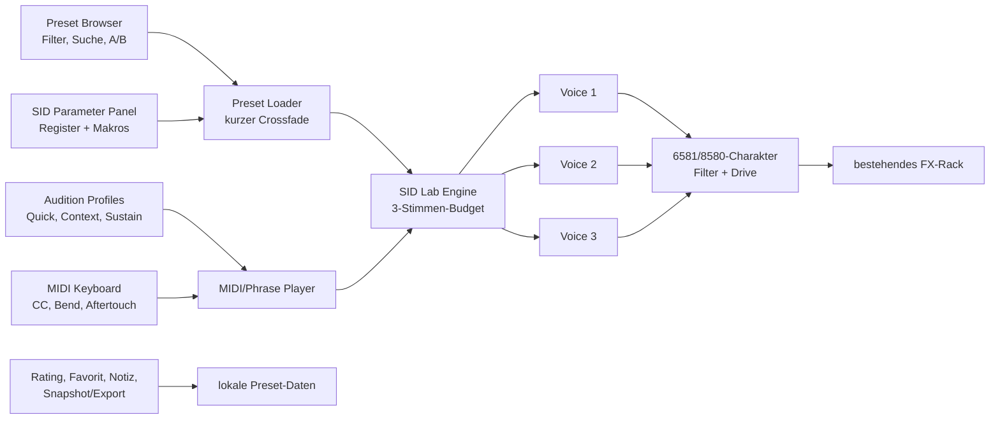

# Plan 1 – C64-SID-Synthesizer mit 300 Presets

## 1. Ziel und verbindlicher Umfang

Die bestehende React-/TypeScript-Anwendung `synthlab` erhält einen vierzehnten,
direkt spielbaren Synthesizer: **SID Lab**. Er soll die für den Commodore-64-SID
typischen Arbeitsweisen schnell erfahrbar machen, ohne eine historische
Emulation oder fremde Musikdaten vorzutäuschen.

Der Lieferumfang dieser Ausbaustufe ist:

1. eine native Web-Audio-/AudioWorklet-SID-Engine mit drei logischen Stimmen,
2. exakt **300 neue, eigenständig entworfene SID-Presets**,
3. passende, kurze MIDI-Testphrasen für Bass, Arpeggio, Melodie, Akkord,
   Rhythmus, Drone und Soundeffekt,
4. ein schneller Parameter-Editor mit A/B, Favorit, Bewertung und Speicherung,
5. nachvollziehbare Quellen-, Lizenz- und Provenienzangaben,
6. automatisierte Tests sowie akustische und visuelle Browser-QA.

Nach der Integration umfasst die Bibliothek voraussichtlich 14 Engines und
1.431 Presets (bisher 13 Engines/1.131 Presets plus 300 SID-Presets). Diese
Gesamtzahl wird im Test aus den tatsächlichen Daten berechnet und nicht nur in
der Oberfläche fest eingetragen.

Nicht Bestandteil dieser Ausbaustufe sind:

- ein cycle-exakter 6581-/8580-Emulator,
- ein eingebetteter PSID-/RSID-Musikplayer,
- eine Kopie von HVSC-Songs,
- aus Songs extrahierte Instrument-, Wave-, Pulse- oder Filtertabellen,
- Samples oder Melodien bekannter C64-Komponisten.

## 2. Rechercheentscheidung

### 2.1 Primäre technische Basis

Als primäre Referenz wird
[`stevi84/sid-player`](https://github.com/stevi84/sid-player) verwendet.

Gründe:

- MIT-Lizenz,
- TypeScript und Web Audio statt VST-Host-Abhängigkeit,
- AudioWorklet-Architektur,
- drei Stimmen,
- direkte Parameter für Wellenform, Frequenz, Pulsbreite, Sync und Ringmodulation,
- Hüllkurven- und Filtersteuerung,
- keine Runtime-Abhängigkeiten.

Die Engine wird nicht blind als Fremdmodul eingebaut. Nach der Lizenzprüfung
werden nur die benötigten Teile entweder sauber adaptiert oder mit deutlicher
Attribution übernommen. Die konkrete Commit-ID wird beim Vendoring fixiert.
Die bekannte Einschränkung wird auch in der App genannt: SID-inspiriert,
nicht cycle-exakt.

### 2.2 Ergänzende permissive Referenzen

- [`igorski/VSTSID`](https://github.com/igorski/VSTSID), MIT:
  Referenz für PWM, ADSR, Portamento, Tempo-Arpeggio und Ringmodulation.
- [`devinvenable/c64SIDkit`](https://github.com/devinvenable/c64SIDkit), MIT:
  Referenz für SID-ADSR-Zeitklassen, Register-nahe Parameter, Sweeps,
  Vibrato und portable Effekt-Patches.
- [`JC-000/c64-sid-instruments`](https://github.com/JC-000/c64-sid-instruments),
  CC BY 4.0: optionale Schema-/Formatreferenz für 6581/8580. Enthaltene
  Instrumentdaten werden nur übernommen, wenn Attribution und Datenherkunft
  vollständig dokumentiert sind. Sie zählen nicht automatisch zum 300er-Bank.

### 2.3 Nur als Recherche, nicht als eingebettete Engine

Folgende Projekte werden wegen Copyleft, ungeklärter Herkunft oder einer
ungeeigneten Playback- statt Patch-API nicht in den Anwendungscode kopiert:

- `libsidplayfp`, `reSID` und `sidflow/libsidplayfp-wasm` (GPL),
- `jhohertz/jsSID` und davon abgeleitete Quellen mit uneindeutiger Provenienz,
- `chip-player-js` (GPL und primär Dateiwiedergabe),
- `websid` ohne ausreichend klare GitHub-Lizenzlage,
- Repositories, die geschützte `.sid`-Sammlungen mitliefern.

Diese Entscheidung verhindert, dass die bestehende Anwendung unbeabsichtigt
unter eine inkompatible Lizenz fällt.

## 3. Urheberrecht und Provenienz

HVSC weist darauf hin, dass die enthaltenen Musikstücke urheberrechtlich
geschützt sind und eine über private Wiedergabe hinausgehende Verwendung
zusätzliche Rechte erfordern kann:
[`HVSC Copyright Information`](https://www.hvsc.c64.org/info#copyright).

Deshalb gelten folgende feste Regeln:

1. Keine SID-Datei und keine daraus extrahierte Instrumenttabelle wird gebündelt.
2. Keine Melodie, kein Arrangement und kein D418-Sample wird nachgebaut.
3. Alle 300 Presets entstehen aus elementaren Syntheseparametern und allgemeinen,
   dokumentierten SID-Techniken.
4. Stilgruppen heißen in den Daten beispielsweise `Hubbard-era technique study`
   und niemals `Original Rob Hubbard preset`, `by Rob Hubbard` oder
   `authentisches Instrument`.
5. Die Oberfläche zeigt:
   „Eigenständiger SID-Presetentwurf; keine Originalmelodie, kein Treiber,
   keine Instrumenttabelle und kein Sample des genannten Komponisten enthalten.
   Keine Verbindung oder Empfehlung durch die genannten Künstler.“
6. Jeder Presetdatensatz enthält:
   `originalDesign: true`, `containsExtractedData: false`,
   `techniqueReferences[]` und eine Generatorversion.
7. Fremddateien erhalten in `research/LICENSES.md` URL, Commit, Urheber,
   Lizenz, Verwendungsart und bei tatsächlich übernommenen Dateien einen Hash.

Für tatsächlich authentische Instrumente von Rob Hubbard, Martin Galway,
Ben Daglish oder Fred Gray wäre eine separate schriftliche Lizenz der
jeweiligen Rechteinhaber nötig. Bis dahin dienen ihre dokumentierten
Arbeitsweisen ausschließlich als historische Technikreferenz.

## 4. Zielarchitektur



### 4.1 Engine-Eigenschaften

Die erste produktive Version bildet folgende SID-nahe Funktionen ab:

- drei logische Stimmen mit gemeinsamem Filter und Master-Ausgang,
- Dreieck, Sägezahn, variable Pulswelle und deterministisches Rauschen,
- SID-nahe Attack-/Decay-/Release-Zeitklassen,
- Sustain, Gate und Release,
- Pulsbreitenmodulation,
- Vibrato und Tonhöhensweep,
- Portamento,
- Ringmodulation,
- Hard-Sync,
- internes Arpeggio beziehungsweise schnelle Akkordillusion,
- Tiefpass, Hochpass, Bandpass, Resonanz und Filterfahrt,
- wählbarer Charakter `6581`, `8580` oder `Neutral`,
- kontrollierte Sättigung und DC-/Pegel-Schutz,
- deterministischer Zufalls-Seed für vergleichbare A/B-Tests.

Die Bezeichnung in UI und Dokumentation lautet **SID-style / non-cycle-accurate**.

### 4.2 Stimmenbudget

Ein physischer SID besitzt drei Oszillatorstimmen. Dieses Limit wird als
musikalisches Designmerkmal sichtbar:

- normale Presets: `voiceCost = 1`, maximal drei gleichzeitig gespielte Noten,
- Ring-/Sync-Kombinationen: `voiceCost = 2`, maximal eine vollständige Note
  plus kontrollierte Hilfsstimme,
- dreistimmige Akkord-/Drum-Kits: `voiceCost = 3`, monophon getriggert,
- Voice-Stealing erfolgt deterministisch nach „älteste freigegebene, dann
  älteste aktive Stimme“.

Der bestehende Engine-Vertrag wird nur minimal erweitert. Andere Synthesizer
behalten ihr bisheriges Polyphonieverhalten.

## 5. Exakte Struktur der 300 Presets

Es gibt fünf kuratierte Sammlungen mit je 60 Presets. Vier Sammlungen sind
historische Techniklinsen; `SID Lab` deckt neutrale und experimentelle
Varianten ab. Sämtliche Patches sind Originalentwürfe.

| Familie | Hubbard-era | Galway-era | Daglish-era | Gray-era | SID Lab | Summe |
|---|---:|---:|---:|---:|---:|---:|
| Wave/ADSR/Chip-Basics | 4 | 4 | 4 | 4 | 8 | 24 |
| Bass/Sub/Sequence Bass | 8 | 8 | 9 | 9 | 8 | 42 |
| Lead/Melody/Brass/String | 9 | 9 | 9 | 9 | 6 | 42 |
| Arp/Chord Illusion | 9 | 8 | 7 | 8 | 4 | 36 |
| Pluck/Keys/Organ/Folk | 5 | 4 | 7 | 5 | 3 | 24 |
| Pad/Drone/Atmosphere | 5 | 9 | 4 | 6 | 6 | 30 |
| Percussion/Rhythm/Cowbell | 8 | 7 | 10 | 8 | 9 | 42 |
| SFX/Noise/Transition | 5 | 5 | 5 | 6 | 9 | 30 |
| Hard Sync, zwei Stimmen | 3 | 3 | 2 | 2 | 2 | 12 |
| Ring Mod/Metal, zwei Stimmen | 3 | 3 | 2 | 2 | 2 | 12 |
| Filter/PWM-Demonstratoren | 1 | 0 | 1 | 1 | 3 | 6 |
| **Summe** | **60** | **60** | **60** | **60** | **60** | **300** |

Jedes Preset erhält mindestens:

```ts
{
  id: string;
  name: string;
  engineId: "sid-chip";
  role: PresetRole;
  params: SidParams;
  tags: string[];
  voiceCost: 1 | 2 | 3;
  chipModel: "6581" | "8580" | "both";
  motion: "static" | "subtle" | "animated" | "extreme";
  brightness: number;
  attackClass: "instant" | "short" | "medium" | "slow";
  auditionProfile: SidAuditionProfileId;
  originalDesign: true;
  containsExtractedData: false;
  techniqueReferences: string[];
  generatorVersion: string;
}
```

Die Bank wird deterministisch aus kuratierten Basisrezepten und begrenzten,
musikalisch sinnvollen Varianten erzeugt. Sie wird nicht durch 300 zufällige
Kombinationen aufgefüllt. Namen, IDs und Parameter bleiben zwischen Builds
stabil.

## 6. Techniklinsen der vier Komponistengruppen

Die Gruppen verwenden keine geschützten musikalischen Inhalte. Sie ordnen
allgemein beschriebene Arbeitsweisen:

- **Hubbard-era:** schnelle Akkordillusionen, rhythmische Sequenzbässe,
  prägnante PWM-Leads, orchestrale Rollenverteilung.
- **Galway-era:** schnelle Arpeggien, lebhafte PWM, atmende Flächen,
  percussive beziehungsweise sampleähnliche Klanggesten ohne Samples.
- **Daglish-era:** bewegte Filterfahrten statt statischer Cutoffs,
  klare folkartige Plucks/Leads, starke Rhythmusfunktionen.
- **Gray-era:** Ringmodulation für metallische Effekte, sparsame Filterung,
  12/8-Pulse und volle dreistimmige Akkordgesten.
- **SID Lab:** neutrale Chip-Basics, Kalibrierung, Extreme, Ambient-Drones
  und moderne experimentelle Ableitungen.

Die Quellenlinks werden je Technikfamilie in der Dokumentation hinterlegt.

## 7. MIDI- und Hörtestsystem

### 7.1 Zwölf originäre Audition-Profile

Alle Testphrasen werden neu komponiert und enthalten keine bekannte C64-Melodie.

1. `BASS_LOCK`: zwei Takte bei 88 BPM; C1/G1/Bb1/C2, synkopierte Achtel.
2. `BASS_DRONE`: acht Sekunden C1, danach G1; langsame Modwheel-Fahrt.
3. `ARP_HELD`: gehaltenes C3 zum Prüfen interner Arpeggio-/Wavetable-Bewegung.
4. `ARP_EXTERNAL`: zwei Takte Sechzehntel aus Cm(add9) bei 96 BPM.
5. `MELODY_STACC`: viertaktiges, originäres Motiv; kurze Gates,
   zwei Velocity-Ebenen.
6. `MELODY_LEGATO`: überlappende Noten mit Pitchbend von ±2 Halbtönen.
7. `CHORD_ALLOC`: Cm(add9)–Abmaj7–Ebmaj9–Bbsus2 mit maximal drei
   Stimmen und Voice-Leading.
8. `DRONE_EVOLVE`: zwölf Sekunden C2 mit langsamer CC1-/CC74-Fahrt.
9. `RHYTHM_GRID`: zwei Takte bei 100 BPM mit GM-Noten für Kick, Snare,
   Hi-Hat, Tom und Cowbell; je Preset wird die passende Rolle isoliert.
10. `FX_ONESHOT`: C2/C3/C4/C5, drei Velocity-Stufen und Pitchbend.
11. `SYNC_RING_PAIR`: monophone C2–G2–C3-Sequenz mit Modulatorverhältnissen
    0,5 / 1 / 1,5 / 2.
12. `RANGE_VELOCITY`: C1/C3/C5 jeweils mit Velocity 40/80/120.

### 7.2 Drei Hörlängen

- **Quick**: 2,5–4 Sekunden für schnelles Durchsteppen,
- **Context**: circa 8 Sekunden für die musikalische Rolle,
- **Sustain**: 12–15 Sekunden für Hüllkurve, Filterfahrt und Modulation.

Beim nächsten/vorherigen Preset bleibt der Testmodus erhalten. Optional wird
sofort oder auf die nächste Viertelnote gewechselt. Ein Crossfade von
20–50 ms vermeidet Klicks. A/B verwendet denselben Seed, dieselbe Phrase,
Velocity und Effektkonfiguration.

### 7.3 MIDI-Zuordnung

- CC1: Motion/Arpeggio-Tiefe
- CC74: Filter-Cutoff
- CC71: Resonanz
- CC73: Attack
- CC75: Decay
- CC70: Sustain
- CC72: Release
- Channel Aftertouch: Vibrato
- Pitchbend: ±2 Halbtöne

Die Computertastatur und ein angeschlossenes MIDI-Keyboard bleiben nutzbar.
Ring-/Sync-Presets erhalten zusätzlich „Modulator solo“ und „Kombination“ zum
schnellen Diagnostizieren.

## 8. Umsetzung in verbindlicher Reihenfolge

### Phase 0 – Arbeitsstand sichern und Eingriffsfläche begrenzen

1. Git-Status und vorhandene, nicht eingecheckte Änderungen erfassen.
2. `synthlab` als einziges App-Ziel bestätigen; `ambient-lab` bleibt unangetastet.
3. Nur SID-bezogene Dateien ergänzen und Überschneidungen mit laufenden
   Multitrack-/Arpeggiator-/FX-Arbeiten einzeln prüfen.
4. Ausgangs-Build und vorhandene Tests protokollieren.

**Gate:** Keine Nutzeränderung wurde überschrieben.

### Phase 1 – Quellen reproduzierbar übernehmen

1. Die ausgewählten Repositories flach nach `research/vendor/` klonen:
   `stevi84/sid-player`, `igorski/VSTSID` und `devinvenable/c64SIDkit`.
2. Exakte Commit-IDs und Lizenzen erfassen.
3. Relevante Architektur-/DSP-Dateien inventarisieren.
4. GPL- oder Songdaten explizit von der Lieferanwendung ausschließen.
5. `research/LICENSES.md` und eine SID-Quellenübersicht aktualisieren.

**Gate:** Für jede verwendete Codezeile ist Quelle und Lizenz bekannt.

### Phase 2 – Datenmodell und Engine-Vertrag

1. `sid-chip` als neue Engine-ID registrieren.
2. SID-Parameter mit Bereichen, Defaults, UI-Einheiten und MIDI-Mapping
   definieren.
3. Optionales `maxVoices`/`voiceCost` ergänzen, ohne andere Engines zu ändern.
4. Presetmetadaten um Audition-Profil und Provenienz erweitern.
5. Migration/Fallbacks für bestehende gespeicherte Presets festlegen.

**Gate:** TypeScript- und Schema-Tests akzeptieren alte und neue Presets.

### Phase 3 – SID-Audioengine

1. AudioWorklet beziehungsweise den risikoärmsten kompatiblen Web-Audio-Pfad
   in den bestehenden `Engine`-/`Voice`-Vertrag integrieren.
2. Oszillatoren, SID-Zeitklassen und Gate-Hüllkurve umsetzen.
3. Pulsbreite/PWM, Vibrato, Glide und Pitch-Sweep ergänzen.
4. Ringmodulation und Hard-Sync mit explizitem Stimmenverbrauch ergänzen.
5. gemeinsamen Multimode-Filter, Resonanz, Drive und 6581-/8580-Charakter
   ergänzen.
6. deterministisches Noise und Modulations-Seeding einbauen.
7. Pegel, DC-Anteil, Release-Aufräumen und Node-Lebenszyklus absichern.

**Gate:** Jede Wellenform und Modulationsart ist einzeln hörbar; keine
hängenden Stimmen, Klickserien oder unkontrollierten Pegel.

### Phase 4 – 300er-Presetbank

1. Kuratierte Basisrezepte pro Tabellenzelle erstellen.
2. Musikalisch begrenzte, deterministische Varianten erzeugen.
3. exakt 60 Presets pro Techniklinse und 300 insgesamt validieren.
4. passendes Audition-Profil, Rollen, Chipmodell und Stimmenkosten zuweisen.
5. generische Presetgeneration für `sid-chip` überspringen, damit nicht
   versehentlich weitere 87 unkuratierte SID-Presets entstehen.
6. IDs, Namen, Parameterbereiche, Duplikate und Seeds testen.

**Gate:** Exakt 300 gültige SID-Presets; keine Dublette und keine Fremddaten.

### Phase 5 – Schnelle Bedienoberfläche

1. SID im Enginefilter und in der Presetübersicht anzeigen.
2. kompaktes SID-Panel für Wellenform, ADSR, Pulsbreite, Filter,
   Chipcharakter, Sync/Ring, Sweep und internes Arpeggio ergänzen.
3. Parameteränderungen sofort hörbar machen und als bearbeiteten Snapshot
   markieren.
4. „Vorheriges“, „Nächstes“, Zufall innerhalb Filter, A/B und
   Favorit/Bewertung per Tastatur erreichbar machen.
5. Filterchips für Rolle, Techniklinse, 6581/8580, Motion und `voiceCost`
   ergänzen.
6. rechtlichen Herkunftshinweis kompakt, aber sichtbar anzeigen.

**Gate:** Ein Preset kann ohne Maus in wenigen Sekunden geladen, gehört,
verändert, bewertet und weitergeschaltet werden.

### Phase 6 – Automatische musikalische Ansteuerung

1. die zwölf SID-Audition-Profile implementieren,
2. je Preset automatisch ein sinnvolles Profil auswählen,
3. Quick/Context/Sustain und sofort/quantisiert anbieten,
4. CC, Pitchbend, Aftertouch und externes MIDI durchreichen,
5. A/B mit identischem Eingabematerial und Seed garantieren,
6. Ring-/Sync-Diagnose und 3-Stimmen-Stresstest ergänzen.

**Gate:** Bass, Arp, Lead, Pad, Rhythmus und FX werden ohne manuelle
Noteneingabe aussagekräftig vorgehört.

### Phase 7 – Bewertung, Speicherung und Export

1. Favorit, Sterne, Notiz und A/B-Slot lokal persistent machen.
2. bearbeitete Varianten als neue User-Presets speichern, Factory-Presets
   unverändert lassen.
3. JSON-Export/-Import mit Schema- und Versionsprüfung ergänzen.
4. Filter und Sortierung nach Bewertung, letzter Bearbeitung und Favorit
   sicherstellen.

**Gate:** Ein Reload verliert keine gespeicherte Bewertung oder User-Variante.

### Phase 8 – Tests und Qualitätsprüfung

Automatisiert:

- exakt 300 SID- und voraussichtlich 1.431 Gesamtpresets,
- 60 Presets je Techniklinse,
- Matrixsummen und Familienzahlen,
- eindeutige/stabile IDs,
- gültige Parameterbereiche,
- deterministische Generierung,
- korrektes Stimmenbudget,
- Note-on/off, Release und Cleanup,
- Profilzuordnung für alle 300 Presets,
- keine verbotenen Dateitypen oder SID-Songdaten im App-Bundle,
- Typecheck, Lint, Unit-Tests und Production-Build.

Im Browser:

- AudioContext-Unlock,
- zehn schnelle Presetwechsel ohne Klicks oder hängende Stimmen,
- A/B-Gleichheit des Eingabematerials,
- Tastatur- und MIDI-Bedienung,
- Filter/Suche/Rating/Save/Reload,
- responsive Layouts,
- CPU-/Speicherbeobachtung bei drei Stimmen, PWM, Filter und FX,
- Stichprobe aus jeder der 55 Matrixzellen.

Akustisch:

- Pegelvergleich gegen bestehende Engines,
- 6581-/8580-Charakter hörbar, aber nicht irreführend,
- Bass bleibt tragfähig, Leads schneiden durch, Drones entwickeln sich,
- Percussion und FX reagieren sinnvoll über mehrere Tonhöhen/Velocities,
- Release-Tails werden nicht abgeschnitten und akkumulieren nicht.

**Gate:** Keine kritische Regression; alle Akzeptanztests grün.

### Phase 9 – Dokumentation und lieferbarer Build

1. README um SID-Engine, Bedienung, MIDI-CCs und Grenzen ergänzen.
2. Quellen-/Lizenzdateien vervollständigen.
3. Preset- und Audition-Schema dokumentieren.
4. Production-Build erzeugen und lokal im Browser prüfen.
5. Nur nach erfolgreicher Prüfung eine bereitstellbare Version speichern
   beziehungsweise deployen.

## 9. Voraussichtliche Dateieingriffe

Neue oder klar abgegrenzte Dateien:

- `synthlab/src/audio/engines/sidChip.ts`
- `synthlab/src/audio/worklets/sid-processor.ts` oder äquivalenter Adapter
- `synthlab/src/audio/engines/sidChip.test.ts`
- `synthlab/src/presets/sidPresets.ts`
- `synthlab/src/presets/sidPresets.test.ts`
- `synthlab/src/midi/sidAuditionProfiles.ts`
- `synthlab/src/midi/sidAuditionProfiles.test.ts`
- `synthlab/src/components/SidControlPanel.tsx`
- `synthlab/src/components/SidAuditionPanel.tsx`
- `research/SID_SOURCES.md`

Gezielte Anpassungen:

- Engine-Registry und Audio-Controller,
- Preset-Schema, Bankgenerator und Browserfilter,
- Phrase-/Transport-Anbindung,
- Bewertungs-/Persistenzpfad,
- App-Layout und Hilfetext,
- `research/LICENSES.md`,
- Projekt-README.

## 10. Definition of Done

Die Aufgabe ist erst abgeschlossen, wenn alle folgenden Aussagen zutreffen:

- Die App enthält eine anwählbare, direkt spielbare SID-Engine.
- Die SID-Bank enthält exakt 300 valide, eigenständige Presets.
- Jede Tabellenzelle und jede Spaltensumme entspricht Abschnitt 5.
- Kein geschützter SID-Song und keine extrahierte Komponisten-Instrumenttabelle
  befindet sich im Quellcode oder Build.
- Alle Presets haben Provenienz, Rolle und geeignetes Audition-Profil.
- Drei SID-Stimmen und die Kosten von Ring-/Sync-Patches werden eingehalten.
- Presets lassen sich sehr schnell hören, parametrisch verändern, A/B-testen,
  bewerten und als User-Variante speichern.
- Bass-, Arp-, Melodie-, Akkord-, Rhythmus-, Drone- und FX-Patches werden mit
  passenden originären MIDI-Daten geprüft.
- Bestehende Synthesizer, Tracks, Arpeggiator, FX und Keyboard funktionieren
  weiterhin.
- Typecheck, Tests, Lint und Produktions-Build sind erfolgreich.
- Die Browser-QA ist dokumentiert, Quellen und Lizenzen sind vollständig.

## 11. Hauptrisiken und Gegenmaßnahmen

| Risiko | Gegenmaßnahme |
|---|---|
| AudioWorklet passt nicht synchron in den bestehenden Engine-Vertrag | Adapter früh als Spike bauen; bei Bedarf zunächst kompatiblen Web-Audio-Pfad verwenden und Worklet hinter gleicher Schnittstelle laden |
| „SID“ wird als cycle-exakte Emulation missverstanden | Durchgehend `SID-style / non-cycle-accurate` ausweisen |
| Komponistenname suggeriert Autorschaft | Nur Techniklinse/Ära, sichtbarer Originaldesign-Hinweis, keine Song-/Presetnamen kopieren |
| 300 Varianten klingen zu ähnlich | Kuratierte Familien, Distanzprüfung der Parameter und Hörstichprobe jeder Matrixzelle |
| Drei-Stimmen-Limit kollidiert mit bestehender Polyphonie | Engine-spezifisches Stimmenbudget und deterministisches Voice-Stealing |
| Schnelles Umschalten erzeugt Klicks oder Leaks | 20–50-ms-Crossfade, Release-/Dispose-Tests und Browser-Stresstest |
| Fremdlizenz kontaminiert die App | Nur permissiv geprüfte Quellen; GPL/unklare Daten bleiben reine Recherche |
| Laufende Nutzeränderungen werden überschrieben | kleine, additive Patches; Git-Diff vor und nach jeder Integrationsphase |

## 12. Prüfreihenfolge für die Umsetzung

Die nachfolgende Implementierung hält strikt diese Reihenfolge ein:

1. `plan1.md` fertigstellen,
2. Ausgangszustand testen,
3. permissive Referenzrepos beziehen und dokumentieren,
4. Engine und Datenmodell,
5. 300 Presets,
6. Audition und UI,
7. Speicherung,
8. automatisierte und akustische QA,
9. Dokumentation und lieferbarer Build.

Kein Code aus einem recherchierten Repository wird vor Abschluss und Ablage
dieses Plans in die Anwendung übernommen.
