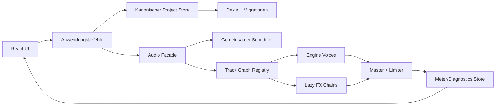

# SynthLab – Analyse und drastischer Verbesserungsplan

## Ergebnis der Analyse

SynthLab ist ein technisch beachtlicher Prototyp, aber noch kein belastbares Musikproduktionswerkzeug. Die Synthese- und Preset-Basis ist umfangreich; die größten Probleme liegen momentan in Zustandskonsistenz, Echtzeit-Performance, Mehrspurverhalten, Persistenz, Bedienbarkeit und Testtiefe.

Aktueller Stand:

- Rund 8.820 Zeilen TypeScript/TSX/CSS in 82 Quelldateien.
- 19 registrierte Engines und 1.681 generierte Presets.
- Build, Typecheck und Lint erfolgreich.
- 30 von 30 Tests erfolgreich.
- Produktionsbundle: 401 kB JavaScript, 113 kB gzip.
- `npm audit --omit=dev`: keine bekannten Schwachstellen.

## Wichtigste Befunde

### P0 – Funktionale Fehler

#### 1. Mehrspurzustand und Audiozustand laufen auseinander

- Mute verändert nur den Zustand, nicht den Audio-Graphen: `synthlab/src/ui/TrackList.tsx:78`.
- Entfernte Tracks bleiben im `AudioController` bestehen und können Nodes, Clips und Ressourcen behalten: `synthlab/src/store/tracksStore.ts:64`, `synthlab/src/audio/AudioController.ts:73`.
- Beim Track-Wechsel wird das aktuell im Browser gewählte Preset auf den neuen Track geladen. Das bereits dem Track zugewiesene Instrument wird nicht wiederhergestellt: `synthlab/src/App.tsx:88`.
- `armed` ist überwiegend visueller Zustand; die Aufnahmefunktion erzwingt oder nutzt ihn nicht zuverlässig.

Damit ist das versprochene unabhängige Mehrspurmodell momentan nur teilweise funktionsfähig.

#### 2. Der Phrase-Player kann gehaltene Noten doppelt starten

`setPhrase()` startet Hold-Noten unabhängig vom Transportzustand. `start()` startet sie erneut: `synthlab/src/midi/player.ts:43`, `synthlab/src/midi/player.ts:72`. Das kann doppelte Drone-Stimmen und schwer nachvollziehbare Voice-Zustände erzeugen.

#### 3. Gefilterte Navigation überspringt Presets

Nach Bewertung oder Verwerfen kann das aktuelle Preset sofort aus der Filtermenge verschwinden. `stepFiltered()` behandelt die nicht mehr gefundene Position als `0` und springt anschließend auf Position `1`: `synthlab/src/store/sessionStore.ts:108`. Gerade der zentrale Bewertungsworkflow kann dadurch Kandidaten überspringen.

#### 4. A/B, Variation und Undo sind unvollständig

- A/B kann einen anderen Klang laden, ohne UI und kanonischen Projektzustand entsprechend umzuschalten.
- Das Übernehmen einer Variation schreibt jeden Parameter einzeln und erzeugt viele Zwischenzustände.
- Undo ist als leerer Handler verdrahtet: `synthlab/src/App.tsx:210`.
- „Save to collection“ markiert derzeit nur einen Favoriten.

### P1 – Architektur und Performance

#### 1. Die gesamte Anwendung rendert durch das Metering permanent neu

Das Meter schreibt über `requestAnimationFrame` ungefähr 60-mal pro Sekunde React-State: `synthlab/src/audio/AudioController.ts:58`, `synthlab/src/App.tsx:78`. Dadurch werden auch Preset-Browser, FX-Rack, Trackliste und weitere große Teilbäume erneut gerendert.

Besonders ungünstig:

- Bis zu 1.681 Preset-Zeilen werden vollständig erzeugt; echte Virtualisierung fehlt.
- `JSON.stringify(params)` und `JSON.stringify(fx)` werden als Effect-Abhängigkeiten verwendet.
- Das Shortcut-Objekt wird bei jedem Render neu erzeugt, wodurch globale Event-Listener wiederholt entfernt und registriert werden: `synthlab/src/ui/useKeyboardShortcuts.ts:81`.

#### 2. Live-Edits erzeugen unnötige Preset-Neuladungen

Ein Makro ruft zunächst `setLiveParam()` auf und schreibt danach den Store. Die Store-Änderung löst anschließend über den Effect einen kompletten Preset-Hot-Swap aus: `synthlab/src/ui/MacroPanel.tsx:30`, `synthlab/src/App.tsx:88`.

Mehrere Engines implementieren `setParam()` zudem gar nicht oder nur teilweise. Es fehlt eine klare Unterscheidung zwischen:

- sofort änderbaren Parametern,
- Parametern für die nächste Note,
- Parametern, die einen Graph-Neuaufbau verlangen.

#### 3. Einige Audiooperationen sind zu teuer für den UI-Thread

Die Granular-Engine erzeugt pro Stimme einen 2,5-Sekunden-Buffer und berechnet dafür hunderttausende Sinusoperationen synchron: `synthlab/src/audio/engines/granular.ts:12`, `synthlab/src/audio/engines/granular.ts:61`. Zusätzlich existieren Timer pro Granular- und Wavetable-Stimme.

Das erhöht das Risiko für:

- verzögerte Note-ons,
- UI-Ruckler,
- Audio-Dropouts bei Akkorden,
- schlechte Performance auf Mobilgeräten.

#### 4. FX werden auch im ausgeschalteten Zustand vollständig aufgebaut

Jeder Track erzeugt die komplette Effektkette einschließlich Reverb-Struktur. Die Module erhalten weiterhin Eingangssignale, auch wenn ihr Wet-Gain auf null steht. Zusätzliche Tracks erhöhen deshalb AudioNode- und CPU-Kosten frühzeitig.

#### 5. Zwei Wahrheiten für denselben Zustand

React/Zustand hält Preset-, Track-, Transport- und Bewertungszustand; der imperative `AudioController` hält parallel Tracks, Presets, Mute, Scheduler und Aufnahme. Es fehlt eine definierte Synchronisationsgrenze. Viele der funktionalen Fehler sind direkte Folgen davon.

### P1 – Datenintegrität

Das Zod-Schema prüft den allgemeinen Aufbau, aber nicht die engine-spezifische Semantik: `synthlab/src/presets/schema.ts:91`.

Derzeit nicht hinreichend geprüft werden:

- ob eine Engine-ID wirklich existiert,
- ob alle Parameter zur Engine gehören,
- ob Parameter innerhalb ihrer Engine-Grenzen liegen,
- ob keine Parameter fehlen,
- ob FX-Werte ihre dokumentierten Grenzen einhalten,
- ob IDs, Provenienz und Versionsstände migrationsfähig sind.

### P1 – Persistenz

Bewertungen, Favoriten, Notizen, Edits, Tracks, Clips und A/B-Zustände verschwinden bei jedem Reload. `dexie` ist zwar installiert, wird aber nicht verwendet. `tone` ist ebenfalls installiert, aber im Produktcode ungenutzt.

Für ein Werkzeug, dessen Hauptworkflow das Bewerten und Kuratieren von 1.681 Presets ist, ist Datenverlust beim Reload ein grundlegender Produktblocker.

### P2 – UX und Barrierefreiheit

- Track-Zeilen und Preset-Zeilen sind klickbare `div`-Elemente ohne Tastatursemantik.
- Viele Icon-Buttons besitzen keinen verständlichen zugänglichen Namen.
- Die globale Shortcut-Logik entfernt aktiv Fokus von UI-Elementen.
- Keine erkennbare `:focus-visible`-Strategie.
- `index.html` deklariert `lang="en"`, obwohl die Oberfläche deutsch ist.
- Es gibt keine sinnvolle Mobile-/Tablet-Struktur und keine CSS-Breakpoints.
- Die Oberfläche ist extrem informationsdicht; Hierarchie, aktuelle Aktion, Track-Zustand und Fehlermeldungen sind schwer erkennbar.
- MIDI-Fehler werden vollständig verschluckt.
- Kein Error Boundary, kein Wiederherstellungsmodus und keine sichtbare AudioContext-/MIDI-Diagnose.

### P2 – Tests und Betriebsreife

Die vorhandenen Tests prüfen primär Generatoren, Musiktheorie und Arpeggiatorlogik. Nicht getestet sind unter anderem:

- Stores und Navigation,
- `AudioController`,
- `VoiceManager`,
- `PresetLoader`,
- Phrase-Player,
- Track-Lifecycle,
- sämtliche FX,
- fast alle Engine-Lebenszyklen,
- React-Komponenten,
- vollständige Nutzerabläufe,
- Audio-Qualitätsregressionen.

Zusätzlich fehlen:

- ein `test`-Script in `package.json`,
- CI,
- Coverage-Erfassung,
- Browser-/E2E-Tests,
- Performancebudgets,
- Releaseprozess.

### P2 – Dokumentation und Recht

- Die Startansicht nennt noch 1.131 Presets und 13 Engines: `synthlab/src/App.tsx:222`.
- Die README verlangt Node 18, Vite 8 benötigt jedoch mindestens Node 20.19 oder 22.12.
- Die README bezeichnet die gesamte Bibliothek als „kuratiert“, obwohl große Teile algorithmisch erzeugt werden.
- SID- und FM-Bänke werden ebenfalls formelbasiert erzeugt; „300/250 curated presets“ ist daher missverständlich.
- Die README behauptet eine MIT-Lizenz, aber es existiert keine tatsächliche `LICENSE`-Datei.
- Kommentare und Pläne sprechen teilweise noch von 13 Engines.
- Recherchequellen, tatsächlich übernommene Konzepte und bloße Inspiration sollten klarer getrennt werden.

## Empfohlene Zielarchitektur

Wesentliche Regel: Der Projekt-Store entscheidet, wie das Projekt aussehen soll. Der Audio-Layer ist eine abgeleitete Laufzeitprojektion davon und besitzt keine konkurrierende Produktwahrheit.

## Detaillierter Verbesserungsplan

### Phase 0 – Messbare Ausgangsbasis

Aufwand: 1–2 Tage.

- Reproduzierende Regressionstests für alle P0-Probleme schreiben.
- Performanceprofil für 1, 4 und 8 gleichzeitige Stimmen je Engine erfassen.
- Langzeittest mit Preset-Wechseln, Track-Anlage und Panic durchführen.
- Heap-, AudioNode-, Main-Thread- und Render-Messwerte dokumentieren.
- Produktumfang verbindlich definieren: Preset-Tester, Performance-Instrument oder Mini-DAW.

Erfolgskriterien:

- Bekannte Fehler sind automatisiert reproduzierbar.
- Baseline für Note-on-Latenz, Renderfrequenz, CPU und Speicher liegt vor.
- Keine Architekturänderung ohne messbaren Vorher-/Nachher-Vergleich.

### Phase 1 – Funktionale Korrektheit

Aufwand: 3–5 Tage.

- Track-Aktionen atomar mit dem Audio-Layer verbinden.
- Beim Track-Wechsel dessen Preset und Edits wiederherstellen.
- Mute, Entfernen, Recording, Clip-Stopp und Panic vollständig synchronisieren.
- Audio-Graph beim Entfernen eines Tracks garantiert entsorgen.
- Phrase-Player nur im laufenden Zustand Hold-Noten starten lassen.
- Doppelte Hold- und Note-off-Planung verhindern.
- Gefilterte Navigation anhand der Position vor der Mutation berechnen.
- Variation in einem einzigen Store-Update übernehmen.
- A/B als vollständigen Snapshot oder klar definierten Presetvergleich implementieren.
- Leere Undo-Funktion entweder entfernen oder korrekt implementieren.

Definition of Done:

- Vier Tracks können unterschiedliche Presets gleichzeitig behalten.
- Mute ist akustisch wirksam.
- Entfernte Tracks erzeugen keine Stimmen und keine AudioNodes mehr.
- Keine doppelten Drone-Stimmen.
- Bewertungsworkflow überspringt kein Preset.

### Phase 2 – Zustands- und Anwendungsarchitektur

Aufwand: 1 Woche.

- `ProjectState` mit Tracks, Clips, Preset-Edits, Mixer, Transport und Sessiondaten einführen.
- UI-State wie offene Panels und Hover getrennt halten.
- Commands wie `assignPreset`, `patchParams`, `removeTrack`, `acceptVariant` und `rateAndAdvance` definieren.
- Audio-Synchronisation in einen Adapter verlagern.
- Doppelte Filterlogik aus Store und `PresetBrowser` zusammenführen.
- Versionsfähige IDs mit `crypto.randomUUID()` verwenden.
- `App.tsx` in Container für Workspace, Browser, Inspector, Transport und Mixer zerlegen.
- `JSON.stringify`-Effect entfernen.
- Hot-Parameter, Next-note-Parameter und Rebuild-Parameter im Engine-Vertrag deklarieren.

Definition of Done:

- Jede fachliche Aktion hat genau einen kanonischen Zustandsübergang.
- AudioController und UI können nicht mehr unabhängig voneinander „anderer Meinung“ sein.
- Store-Transitions sind isoliert testbar.
- Keine vollständigen Preset-Neuladungen bei normalen Reglerbewegungen.

### Phase 3 – Echtzeit-Audio und DSP

Aufwand: 1–2 Wochen.

- Einen gemeinsamen Lookahead-Scheduler für Phrasen, Clips, Arp und Grains einführen.
- Timer pro Voice reduzieren oder eliminieren.
- Granular-Quellmaterial cachen, vorab erzeugen oder in einen AudioWorklet verschieben.
- Wavetable-Frames cachen und Aktualisierungen begrenzen.
- Engine-Contract-Tests für Trigger, Release, Stop, Dispose und Parameteränderungen entwickeln.
- No-op-`setParam()` explizit als „wirkt auf nächste Note“ modellieren.
- FX lazy erzeugen oder physisch bypassbar machen.
- Dry/Wet-Semantik vereinheitlichen und Pegelkompensation einführen.
- Delay-Ping-Pong- und Freeze-Routing fachlich verifizieren.
- Polyphonie- und Stimmenbudget pro Engine/Track konfigurieren.
- Master-Limiter, Headroom und Metering kalibrieren.
- AudioContext-Unterbrechung, Visibility-Wechsel und Device-Probleme behandeln.

Zielbudgets:

- Note-on-Arbeit auf dem Main Thread p95 unter 3 ms.
- Keine Long Tasks über 50 ms bei Akkorden oder Presetwechseln.
- Keine wachsende AudioNode-/Timer-Anzahl nach wiederholtem Spielen und Stoppen.
- Keine hörbaren Dropouts in einem zehnminütigen Stresstest.
- Gesamtausgang ohne unkontrolliertes Clipping oder starke Pegelsprünge.

### Phase 4 – Persistenz, Undo und Portabilität

Aufwand: 4–6 Tage.

- Dexie tatsächlich verwenden oder die Abhängigkeit entfernen.
- Projekt-, Session- und Preset-Daten getrennt versionieren.
- Automatisches lokales Speichern mit Debounce.
- Migrationen für zukünftige Schemaänderungen.
- Import vor Übernahme vollständig mit Zod und Engine-Schema validieren.
- Export für Projekt, Presetbank und Nutzerbewertungen.
- Undo/Redo als begrenzte Command-History.
- Recovery-Snapshot vor riskanten Importen oder Migrationen.
- Optional MIDI- und WAV-Export als nachgelagerte Produktfunktion.

Definition of Done:

- Reload verliert keinerlei relevante Arbeit.
- Eine alte Datenversion kann migriert oder sicher abgelehnt werden.
- Beschädigte Imports verändern das aktuelle Projekt nicht.
- Undo funktioniert für Parameter, Trackoperationen und Variantenübernahme.

### Phase 5 – UI, UX und Accessibility

Aufwand: 1 Woche.

- Presetliste wirklich virtualisieren.
- Meter in eine isolierte, gedrosselte Komponente auslagern.
- Große Teilbäume mit stabilen Props und selektiven Store-Subscriptions versehen.
- Semantische Buttons/Listboxen statt klickbarer `div`s.
- Alle Controls mit Label, Zustandsanzeige und Tastaturbedienung versehen.
- Shortcut-System auf stabile Handler-Refs umstellen.
- Niemals automatisch Fokus von Controls entfernen.
- Shortcut-Hilfe und konfigurierbares Tastaturlayout anbieten.
- Responsive Layout für Desktop, Tablet und schmale Ansichten entwickeln.
- Inspector statt permanent vollständig aufgeklapptem FX-/Parameterraum.
- Audio-, MIDI-, Speicher- und Importfehler sichtbar melden.
- Empty States, Bestätigungen und sichere Löschabläufe ergänzen.
- Farbkontrast, Fokus und Screenreader-Ausgabe nach WCAG 2.2 AA prüfen.

Definition of Done:

- Vollständiger Kernworkflow nur per Tastatur möglich.
- Presetliste bleibt bei 1.681 Einträgen flüssig.
- Kein Shortcut stört Texteingabe oder native Bedienung.
- UI funktioniert bei 1280 px, 768 px und Touch-Eingabe sinnvoll.

### Phase 6 – Qualitätssicherung und CI

Aufwand: 1 Woche, anschließend fortlaufend.

Testpyramide:

- Unit: Stores, Commands, Filter, Migrationen, Engine-Schemas.
- Contract: Jede Engine und jeder Effekt gegen denselben Lifecycle-Vertrag.
- Offline-Audio: Rendern definierter Noten und Messen von Peak, RMS, DC, Silence, NaN und Tail-Länge.
- Komponenten: React Testing Library für Browser, Tracks und Formulare.
- E2E: Playwright für Audio-Start, Presetwahl, Trackwechsel, Bewertung, Reload und Export.
- Stresstests: wiederholtes Note-on/off, Presetwechsel, Trackanlage und Panic.

CI-Pipeline:

1. Lockfile-Installation.
2. Typecheck.
3. Lint.
4. Unit-/Contract-Tests.
5. Produktionsbuild.
6. E2E in Chromium.
7. Dependency-Audit.
8. Bundlegrößen- und Coverage-Gates.

Empfohlene Gates:

- 90 % Coverage für Stores, Commands und Migrationen.
- 100 % Engine-Contract-Abdeckung.
- Kein ungetesteter P0-Nutzerablauf.
- Bundle-Budget für Initial-JS, beispielsweise unter 150 kB gzip.
- Keine High-/Critical-Abhängigkeit ohne dokumentierte Ausnahme.

### Phase 7 – Dokumentation, Recht und Release

Aufwand: 2–3 Tage.

- Tatsächliche `LICENSE`-Datei ergänzen.
- Third-party Notices und Quellenprovenienz konsolidieren.
- „Generiert“, „handabgestimmt“ und „kuratiert“ korrekt unterscheiden.
- README-Zahlen automatisch aus Registry und Banktest erzeugen.
- Node-Version mit `.nvmrc` oder `.node-version` festlegen.
- `lang="de"`, vollständige Metadaten und verständlicher Produkttitel.
- Architektur-, Engine- und Preset-Schema dokumentieren.
- Alte Pläne als historische Dokumente kennzeichnen oder archivieren.
- Release- und Changelog-Prozess etablieren.

### Phase 8 – Erst danach: Produktausbau

Nach Stabilisierung lohnen sich:

- Mixer mit Volume, Pan, Solo, Sends und Track-Metering.
- Globale Transport-Timeline und sauber synchronisierte Clip-Loops.
- Tempo-synchronisierte Effekte.
- Preset-Sammlungen und intelligente Vergleichssets.
- MIDI-Learn und Controller-Mappings.
- WAV-/MIDI-Export.
- Offline-Analyse und Auto-Tagging.
- PWA-/Offline-Unterstützung.
- Optionales Projekt-Sharing.

## Empfohlene Reihenfolge

Die ersten vier Meilensteine sollten strikt sein:

1. Mehrspur-, Phrase- und Navigationsfehler beheben.
2. Zustand und Audio-Layer entkoppeln.
3. Echtzeitpfade und Engine-Verträge stabilisieren.
4. Persistenz und Regressionstests einführen.

Erst danach sollten UI-Redesign und zusätzliche Features größeren Umfangs beginnen. Andernfalls würden neue Oberflächen auf einem inkonsistenten Zustands- und Audiofundament aufgebaut.

Für eine Einzelperson ist das ein realistischer Verbesserungszyklus von ungefähr sechs bis acht Wochen. Nach den ersten zwei Wochen sollte SynthLab bereits deutlich zuverlässiger sein; nach Abschluss der ersten sechs Phasen wäre es erstmals als belastbare, erweiterbare Anwendung einzuordnen.
